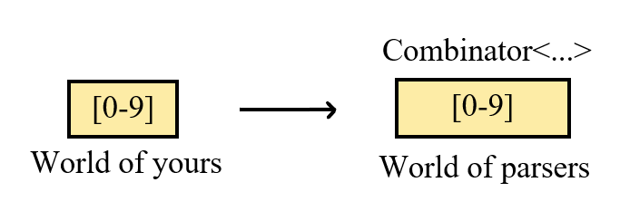

<div style="width: 100%; background-image: url('Images/bg.png'); background-repeat: repeat-x repeat-y; background-positon: 100%,100%;">
    
</div>

&emsp;&emsp;这篇简短的教程将带您构建出一个解析十六进制颜色值的解析器。您在很多地方都见过它：

```css
p {
    color: #21a657;
    border-color: #2a4;
    background-color: rgb(210, 15, 7);
}
```

&emsp;&emsp;上面展示了CSS中的三种写法，为了简便起见，我们只考虑前两种，即只考虑十六进制颜色值的写法。

&emsp;&emsp;我会先总体介绍下`Pb`的用法，然后定义各个数据结构，最后制作它。

**目录**

[TOC]

## Step0. 总体介绍

&emsp;&emsp;本小段会简要提及`Parser Combinator`的思想，以及该库的总体使用方式。

### Parser Combinator?

&emsp;&emsp;Parser Combinator本身只是一种编写`自顶向下分析器`的方式，它在一些方面有优势：

 1. Parser Combinator在一些时候拥有更好的**可读性**，在C++中，借助运算符重载可以做到完全不依赖别的文件——您的C++代码描述的就是整个语法。
 2. 使用例如`Pb`这样的库意味着一切都是自动完成的，比起手工编写递归下降分析器，这样能**减轻一些负担**。

&emsp;&emsp;`Pb`是这样的一个库，用于帮助实现LL文法的回溯式分析器。市面上有很多这样的库，例如`Boost.Spirit`，`Pb`只是一个更小、更简易且不同风格的实现。

### 它是如何工作的?

&emsp;&emsp;`Pb`或者说Parser Combinator的核心想法在于将语言**拆分**成一个个的**小单元**，在`Pb`中，这个最小的单元是单个字符，这里把它叫做Combinator。

&emsp;&emsp;接着，大单元的分析器（例如一个最小单元是一些关键字的Combinator）会去调用更小单元的分析器（例如一个最小单元是单个字符的Combinator），这样就完成了分析。自然的，**大的分析器是使用小的分析器来构建的**：


&emsp;&emsp;在接下来的小节您将看到这个构建过程。但是因为我们的文法比较简单，因此我们只会构建最小单元是字符的Combinator，而不会在此基础上构建更大的Combinator。

## Step1. 安装Pb

&emsp;&emsp;`Pb`的安装非常简单，您只需要将整个仓库`clone`下来即可（目前`Pb`并没有准备好第一个稳定可用的版本，因此您只能暂时通过此方式取得它）：

```bash
git clone --depth=1 https://github.com/JuYanYan/Pb.git
```

&emsp;&emsp;接着，将仓库内的所有文件复制到你想要的位置，在C++代码中包含对应的文件即可：

```c++
// 包含路径和您存放它们的位置有关，做对应修改即可
#include "pb/pb.hpp"
```

&emsp;&emsp;如果可能的话，请先尝试编译一下`pbdemo.cpp`中的全部代码，再使用它。使用如下命令行编译它（以clang为例）：

```bash
clang pbdemo.cpp --std=c++20 -o pbdemo
```

&emsp;&emsp;若使用其它的编译器（例如gcc、msvc++），请不要忘记将标准切到C++ 20。

## Step2. 基本用法

&emsp;&emsp;接下来我们要做的事情是了解`Pb`的基本用法。请打开仓库中的`pbdemo.cpp`。

&emsp;&emsp;本文件总体分了4个部分：

```c++
int main(int argc, char **argv)
{
    // 1. 处理命令行参数
    // 2. 构建Parser
    // 3. 指定一个输入
    // 4. 解析输入, 得到结果
}
```

&emsp;&emsp;我们从第二部分（对应文件的`36`行附近，声明`numbers`变量的地方）开始：

```c++
auto numbers = InRange<ConstString>('0', '9') * N(1, Infinity)
                >> [](const std::vector<unichar> &list) -> Result<uint64_t>
                {
                    // ....
                }
```

&emsp;&emsp;将之**拆为两部分**，第一部分是构建的解析器，第二部分表示如何处理结果：

```c++
auto numparser = InRange<ConstString>('0', '9') * N(1, Infinity);
auto numbers = numparser >> [](const std::vector<unichar> &list) -> Result<uint64_t>
             {
                 // ....
             };
```

&emsp;&emsp;我们先从第一部分开始，对其表达的内容有一定了解。

### Step2.1 构建Parser

#### 类: ConstString

&emsp;&emsp;`ConstString`类应该是最先看到的部分了。它提供一个基本的`lex`，用于在字符串中取得单个的字符。

&emsp;&emsp;该类内部包括一个指针，指向一个字符串。请注意一点，它**不会拷贝任何字符串数据**，因此您需要保证字符串可用，下面是一个错误使用的例子：

```c++
ConstString str = std::string("This is invalid");
```

&emsp;&emsp;在该例子中，`str`指向了一个将亡值（xvalue），当该行代码执行结束，`std::string`类析构，导致先前指向的内存区失效，从而造成问题。

&emsp;&emsp;下面的例子是正确的，`inp`会一直存活到`str`析构之时：

```c++
std::string inp = "This is an input.";
ConstString str = inp;
```

&emsp;&emsp;下面的例子也是正确的，编译器会将字符串常量存放到合适的位置，并在整个程序的进程生命周期内都有效：

```c++
ConstString str = "This is an input.";
```

#### 函数模板: InRange

&emsp;&emsp;函数模板`InRange`表示一个范围内的值，在这里，它意味着匹配下面情况为真的字符：

```c++
bool cond(char ch)
{
    return ch >= '0' && ch <= '9';
}
```

&emsp;&emsp;在`Pb`中，对于每个组合子，需要**指定一个Lex类型**`Tstr`（在一些地方被写为`Tinp`），它是更小一层的“组合子”。这个便是`ConstString`在此处的含义，它表示`InRange`内建的分析函数将使用该类型来取得一个更小的单元（例如在这里，这个更小的单元是字符），并分析它们。

&emsp;&emsp;因此，`InRange<ConstString>('0', '9')`的含义为接受输入是`ConstString`，且是满足上述条件的任意一个字符。

#### 函数: N

&emsp;&emsp;函数`N`是构建闭包描述的，它表示一个闭包（closure）信息，例如上面的`N(1, Infinity)`即表示出现1次到无穷多次，即一个正闭包。

&emsp;&emsp;也可以使用`_n`来构建它，例如`15_n`表示出现15次，它等效于：

```c++
N(15, 15);    // 15_n
```

#### 运算符: \*

&emsp;&emsp;运算符`*`表示前面的项连续出现的次数，例如`a * 7_n`即表示`a`需要连续出现`7`次。

&emsp;&emsp;需要注意的一点是，`*`并**不是可交换的**。即`a * 7_n `并不能写作`7_n * a`。

------


&emsp;&emsp;如此一来，定义的Parser含义就很明确了：

```c++
auto numparser = InRange<ConstString>('0', '9') * N(1, Infinity);
```

&emsp;&emsp;它表示一个输入为`ConstString`，接受`0~9`范围内的任意字符出现1次及以上的Parser。现在我们就可以定义出自己的Parser，但是还有一步——处理分析器的返回值。

&emsp;&emsp;下面我们将详细讨论这些步骤的返回值。

### Step2.2 处理Parser的结果

&emsp;&emsp;处理Parser结果的运算符是`>>`，这点在上面分步的时候非常明显——我们将第一步构造的分析器扔进了一个匿名函数，然后在里面计算出对应的值，最后返回。

&emsp;&emsp;在了解这个运算符之前，我们需要了解之前步骤各个函数、运算符的返回值情况。

#### 重新考虑InRange函数

&emsp;&emsp;在上面的介绍中我们知道了这个函数表示某个范围的字符。但是现在请重新考虑一下——什么是“表示某个范围”呢。

&emsp;&emsp;——实际上，它构造了一个分析器，这个分析器将接受这个条件下的输入。在`Pb`中，类模板`Combinator`可以**近似地**认为是分析器（实际上，`InRange`是这样实现的——它内部包括一个分析器函数，这个函数将用于构造对应的`Combinator`，而在真正分析的时候，则会借助`Combinator`作为跳板，去调用之前构造的分析器函数），这个类模板就是`InRange`函数的返回值。

&emsp;&emsp;如果用一个有意思的图片来表示它的话，`InRange`就像这样，它把我们平时认为的规则，转换到了`Parser`视角下的规则：



#### 类模板: Combinator

&emsp;&emsp;`Combinator`是对分析器函数的一个包装，它使得每个步骤构造的分析器函数能够安全地存储起来，并且在合适的时机能被调用：

```c++
template<
    typename _Tstr,
    typename _Tres>
class Combinator final
{
    // ....
};
```

&emsp;&emsp;模板参数`_Tstr`指定分析器函数的输入类型，而`_Tres`指定分析器的结果类型。例如上面的`InRange<ConstString>('0', '9')`，其指定了输入类型为`ConstString`，由于`ConstString`取得的“单词”是字符，因此其结果也是字符。故：`_Tstr=ConstString`，`_Tres=char`。

#### 结果类型

&emsp;&emsp;通常这里所提到的结果类型就是分析器的输出，例如一个接受某些字符的分析器，其结果肯定是某些字符。

##### 结构体模板: Result

&emsp;&emsp;在`Pb`中，这一点略微不一致——各个Combinator使用`Result`结构来存放结果：

```c++
template<
    typename _Tval>
struct Result
{
    using Tval = std::decay_t<_Tval>;
    // 成功/失败?
    Label label;
    // 成功时的返回值
    Tval succ_val;
    // 失败时的值
    struct Failed
    {
        // 提示信息
        unistring msg;
    } failed_val;
};
```

&emsp;&emsp;模板参数`_Tval`表示应当出现的结果类型，当其表示一个成功的结果时，`succ_val`会对应存放上有效的值。否则，`failed_val`会存放上有效的值。

&emsp;&emsp;成员`label`表示了结果是成功（`Success`）的还是失败（`Error`，含义在于遇到了语法错误）的。

##### 确定结果类型

&emsp;&emsp;一般对于简单的函数（例如`InRange`）来说，其结果类型是很明显的。但是运算符则可能改变它：

&emsp;&emsp;对于运算符`+`，其表示两个Combinator的连接，即“先出现a后出现b”。其结果为二者的笛卡尔积，在C++上表现为`std::tuple`

&emsp;&emsp;对于运算符`|`，其表示选择，即“出现a或者出现b”。其结果为二者的和类型，在a、b的结果都是一样的情况下，其在C++上表现就是a、b的结果类型，如果不一样，那么表现为`std::any`。

&emsp;&emsp;对于运算符`*`，其表示闭包，即“a出现多少次”。结果为元素是a的结果类型的列表类型，在C++上的实现是`std::vector`

&emsp;&emsp;对于函数`Optional`，其表示可选，即“a出现0次或者1次”。结果在C++上的实现是`std::optional`。

#### 运算符: \>\>

&emsp;&emsp;该运算符表示将一个结果转换为另一个结果。例如在上面的程序中，我们将分析器产生的`std::vector<unichar>`类型的数据转换为了`uint64_t`。其用法很简单，`>>`的左边是一个Combinator，其具有结果类型`Ta`，右边是一个转换函数，将`Ta`转换为新的结果`Tb`，例如将单个字符转换为单个整数：

```c++
auto num = InRange<ConstString>('0', '9')
      >> [](unichar ch) -> Result<int>
         {
             return Success(static_cast<int>(ch - '0'));
         };
```

&emsp;&emsp;转换函数的返回值依然需要使用`Result`包装，以方便在其中返回一个错误信息。

### Step2.3 解析字符串

&emsp;&emsp;解析字符串非常简单，不过需要注意的是，`Pb`是有手工的CPS的，因此你需要这样取得返回值：

```c++
bool succ = numbers.Parse(str, [](const Result<uint64_t> &res, const ConstString &nextstr)
{
    if (res.label == Label::Success)
    {
        // 这里是成功时的返回值
        return true;
    }
    else {
        // 这里说明发生了问题
        return false;
    }
});
```

&emsp;&emsp;Continuation函数的返回值表示是否应该继续进行分析，其应该和`Result`的`label`成员相呼应。

## Setp3. 构建我们自己的解析器


