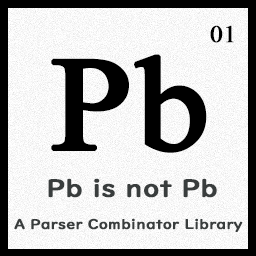

# Pb

<div style="max-height: 256px; margin-left: 2em;">
    
</div>

&emsp;&emsp;这是一个玩具级的Parser Combinator，来自于自己的一个表达式解析器。但是我在sympy中发现了更好的实现，因此那个项目被废弃了😔，这个事情令我感到有些沮丧（呜呜呜要抱抱）。

&emsp;&emsp;我只能将之放弃掉。

&emsp;&emsp;但是，现在，我决定，将其语法分析的部分代码开源。

&emsp;&emsp;它可以让你体验到：

- [x] 以一种自然的方式描述您的文法
- [x] 较低的运行开销
- [x] Header-ONLY, 告别讨厌的build

&emsp;&emsp;未来会考虑加入：

- [ ] 左递归消除

&emsp;&emsp;这意味着您无需使用令人感到迷茫的正则表达式，例如，在`Pb`的帮助下，可以这样去表示一个数字：

```c++
// 对应于[0-9]+
// 这是输入的类型
using Tstr = ConstString;
// [0-9]
auto num_meta = InRange<Tstr>('0', '9');
// 正闭包+
auto numbers = num_meta * N(1, Infinity);
```

&emsp;&emsp;我个人认为这是非常吸引人的，尤其是构建一些简单的解析器的时候（例如解析一个数学表达式、一段json，等等），但是请注意，**优雅**与执行**效率**是不可兼得的，如果决定使用这样看起来更优雅的方式，那么势必要牺牲性能，**选择Parser Generator（例如Yacc、PEG.js）以得到最好的性能**。

## LICENSE

&emsp;&emsp;所有源代码均使用GPL v2分发。前往[LICENSE](LICENSE)查看更多。

&emsp;&emsp;All sources use GPLv2 license.

## Contact

&emsp;&emsp;请前往issue区或者提交新的pr，如果必须再发电子邮件。

&emsp;&emsp;Goto issue or create new pull requestion firstly. If **necessary**, e-mail me: juyanyan@foxmail.com.

## Language

&emsp;&emsp;本仓库注释与文档使用中文或者英语，推荐使用前者。

&emsp;&emsp;We use simplified Chinese or English in documents and comments. If **necessary**, you can use classical Chinese or traditional Chinese to write comments or documents.

